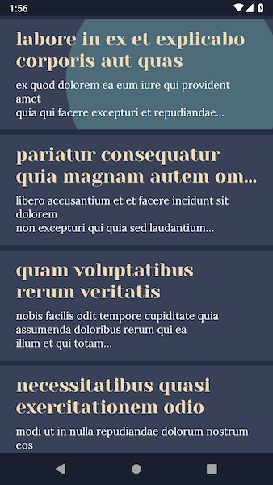
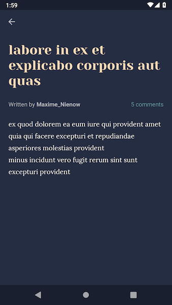

# babylon-test

_A simple but nice-looking news reader_

| List | Detail |
| ---- | ------ |
|  |  |

## Features

* Responsive, quick UX
* Pull to refresh to facilitate recovery from network errors
* Sensible error handling that prioritises content over error
* Support for portrait and landscape
* Custom fonts and colour scheme

## How to

As a pre-requisite, you need to import the project in Android Studio, so that it can generate a specific 
`local.properties` file for your machine. Alternatively, you can create a `local.properties` file yourself in the 
project's root directory. This file will contain the path to the Android SDK, e.g.:

```
sdk.dir=/Users/your-username/Library/Android/sdk
```

### Install the app

To install the app on your device, plug it into your laptop, then please run (from the project's root directory):

```
./gradlew installDebug
```

### Run tests and code checks

To test the code, please run (from the project's root directory):

```
./gradlew check
```

## Copyright

```
Copyright 2019 Francesco Pontillo

Licensed under the Apache License, Version 2.0 (the "License");
you may not use this file except in compliance with the License.
You may obtain a copy of the License at

    http://www.apache.org/licenses/LICENSE-2.0

Unless required by applicable law or agreed to in writing, software
distributed under the License is distributed on an "AS IS" BASIS,
WITHOUT WARRANTIES OR CONDITIONS OF ANY KIND, either express or implied.
See the License for the specific language governing permissions and
limitations under the License.
```
